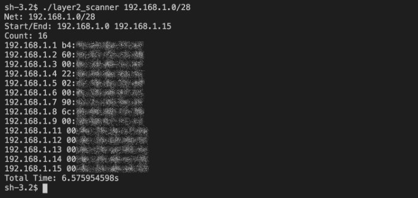

# layer2_scanner
## *For when you absolutely need to know whats on your network.*

This is a network scanning tool that relies on the arp protocol and not the TCP/UDP protocols.  Which means it's firewall bypassing, and can tell you if a device is present even if the device won't return a ping or a port discovery request.

---
## Buy me a coffee
If you feel so inclined as to support my projects. Here's your chance! Thanks 

---

### Usage Examples:
> `./layer2_scanner 192.168.1.0/24`

> `./layer2_scanner 192.168.0.1/24`

### Example Output:
>

#### OS Support:
This application is limited by the libraries that support it. 
1. Linux
2. MacOS
3. BSD